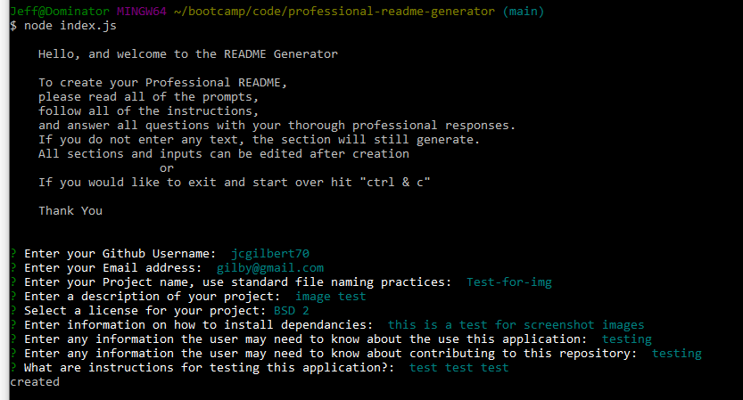
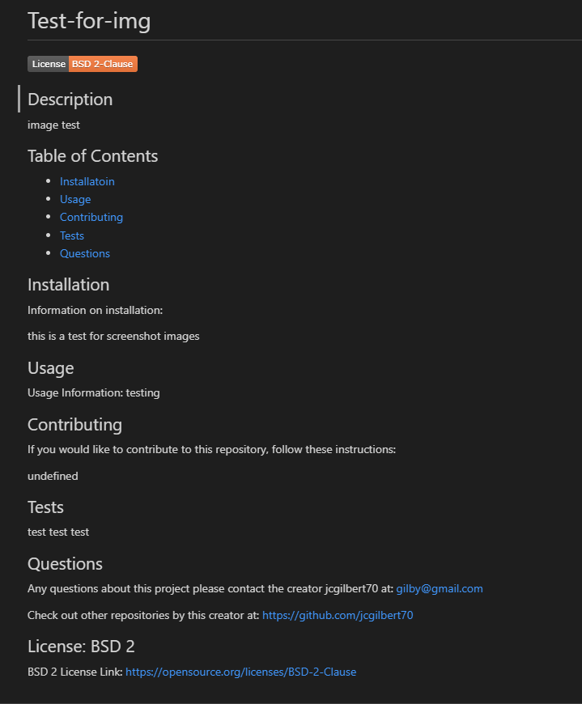

  # Professional README Generator

  

  ## Description
   This application is to be a quick and easy way to generate a professional README for any project through the input reply of a number of prompts. This README Generator will allow the user to apply one of several liscenses and not only have the badge present on their README, but a section of their README with which liscense is applied along with a link to that liscense's webpage. 

  ## Table of Contents
  - [Installatoin](#installation)
  - [Usage](#usage)
  - [Contributing](#contributing)
  - [Questions](#questions)
  
  ## Installation
  
  Information on installation: 
  
  To install the dependencies for this Professional README Generator, you will need to input "npm i".   Inquirer and FS are required for this application.

  ## Usage

  Usage Information: 

  This application uses the node.js and the terminal to generate a README. It requires the usage of "inquirer" to generate the README, and upon completion creates a new README with the title of the project as the prefix to "README.md". In order to use this application you need to clone the repo to your desktop, and either open your terminal and locate this file or within "VS Code" open the Integrated Terminal. You will first need to install the dependencies with "npm i". Then finally to run the application input "node index.js" which will begin the prompts for the README to be generated from.

  ## Contributing
  If you would like to contribute to this repository, follow these instructions: 
  
  This repository is open to the public to access, please feel free to comment.

  ## Questions
  Any questions about this project please contact the creator jcgilbert70 at:
  jcgilbert70@gmail.com
  
  Check out other repositories by this creator at: https://github.com/jcgilbert70

  ## Screenshots

  
  
  

  ## Repository

  https://github.com/jcgilbert70/professional-readme-generator.git

  ## Video Link

  https://app.castify.com/view/f01823c9-29d9-4873-ba10-48e11df86e45

  ## License: MIT
  
  MIT License Link: https://opensource.org/licenses/MIT

  
